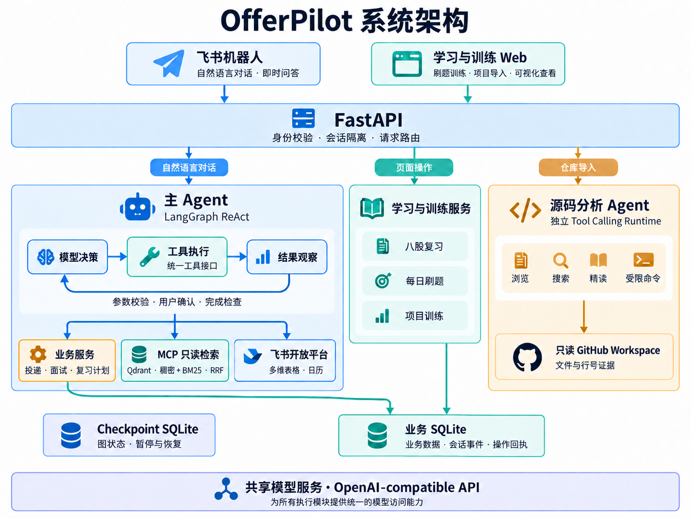

# OfferPilot

> 飞书原生 AI 求职管理与训练 Agent：把投递、面试、刷题、知识复习和项目训练放进一条可确认、可追踪、可恢复的执行链路。

OfferPilot 面向计算机专业学生的秋招与实习准备场景。用户可以直接在飞书中用自然语言管理投递和面试，也可以在配套网页中完成 LeetCode 复习、八股问答、GitHub 项目分析与项目面试训练。

项目的重点不是再做一个聊天机器人，而是让模型在统一的 ReAct 循环中通过受控工具真正执行任务：观察结果、调整步骤、请求必要审批、更新业务状态，并把结果同步到飞书多维表格和日历。

**技术栈：** Python · FastAPI · LangGraph · MCP / FastMCP · Qdrant · SQLite · OpenAI-compatible API · 飞书开放平台

[功能演示](#功能演示) · [系统架构](#系统架构) · [本地启动](#quick-start)

## 功能演示

三段 GIF 展示飞书中的实际操作与结果，三张截图展示配套学习页面。素材位于 [`show/`](show/)，点击图片可查看原图。

### 1. 投递确认与表格同步

用自然语言记录公司和岗位，核对确认卡片后执行写入，最后在飞书多维表格中查看对应记录。


**演示结论：** 从聊天输入到实际数据写入形成闭环。对应技术：LangGraph `interrupt` / checkpoint、工具参数校验、写操作确认与飞书多维表格同步。

### 2. 面试安排与飞书日历

通过对话记录面试时间和轮次，确认后收到包含公司、岗位与具体起止时间的飞书日历邀请。


**演示结论：** 自然语言中的面试安排转化为可查看的日历事件。对应技术：带时区的时间处理、外部写操作审批与日历 API 集成。

### 3. 知识问答与来源引用

以“MySQL 联合索引为什么遵循最左匹配原则”为例，展示原理解释、SQL 示例，以及回答末尾的参考链接和知识库证据 ID。


**演示结论：** 技术回答附带可核对的来源，而不只给出结论。对应技术：只读 MCP 检索、Qdrant 混合召回、RRF 排序与稳定证据 ID；知识检索本身不是实时全网搜索。

### 4. 八股复习

按知识分类逐题练习，提供文字与语音回答入口，并展示今日复习进度、提示和薄弱题目入口。


**页面展示：** 将知识库组织为可持续练习的学习入口；图中为作答页面，不包含本次评分结果。

### 5. 每日刷题

查看今日题目和顺延任务，跳转 LeetCode 做题，再按实际情况记录“独立完成”“提示完成”或“明天继续”等反馈。


**页面展示：** 将推荐、练习与完成反馈连接起来；完成情况由用户反馈，不自动读取 LeetCode 提交记录。

### 6. 项目档案与训练入口

展示 GitHub 项目分析入口、已有项目档案、档案版本，以及开始训练、编辑和继续历史训练的入口。


**页面展示：** 项目档案是源码分析与面试训练的连接点；当前截图展示入口和档案，不代替源码分析及多轮训练全过程的实录。

## 三条核心流程

### 1. 求职执行闭环

```text
飞书自然语言消息
  → 从 LangGraph checkpoint 恢复线程状态
  → Agent 选择工具并观察执行结果
  → 参数校验与按影响级别审批
  → 成功 / 失败 observation 回到 Agent 继续决策
  → 完成性检查与最终答复
  → 业务数据、执行 ledger 与 checkpoint 持久化
  → 飞书多维表格与日历同步
```

支持新增投递、更新阶段、记录面试轮次、补全时间、生成后续任务，以及暂停、恢复或取消待执行动作。复杂任务可以维护一份用户可见的动态 plan；plan 会随工具结果更新，但不负责硬编码图路由。

### 2. 每日学习闭环

```text
LeetCode Hot 100 / Markdown 知识库
  → 确定性推荐与间隔复习
  → 网页或飞书提醒
  → 用户作答 / 语音转写
  → AI 评分与参考答案
  → 掌握度、薄弱点和下次复习时间
```

算法推荐使用本地公开元数据快照，八股学习中心可把本地 Markdown 增量解析为结构化题库。主 Agent 还能把“本周面试 + 薄弱知识点”组合成 StudyPlan：首次缺少学习偏好时通过 interrupt 收集，确定性调度器生成 `study_sessions`，未排期项与计划一起持久化，用户审批后再幂等同步到日历；后续可通过只读工具重新查询计划和 session。

### 3. 项目分析与面试训练闭环

```text
GitHub 仓库 URL
  → 隔离的只读 Workspace
  → 文件浏览 / 精确读取 / 代码搜索 / 受限命令
  → Agent 主动探索与上下文压缩
  → 项目画像与代码证据
  → 用户确认
  → 针对目标岗位的多轮项目面试训练
```

分析 Agent 不接受任意 Shell 字符串，只能调用结构化的只读工具；运行时同时限制模型轮次、工具次数、累计 Token、单次输出和工作区路径。

## 能力概览

| 模块 | 已实现能力 |
| --- | --- |
| Agent Runtime | 统一的 LangGraph ReAct 循环，覆盖工具校验、观察反馈、失败重规划、完成性检查和运行预算。 |
| Durable Execution | 原生 checkpoint 与 interrupt 支持跨请求暂停/恢复；动态 plan 仅作为可变工作记忆。 |
| Application Workflow | 管理公司、岗位、投递阶段、面试轮次、下一步动作与用户级会话草稿。 |
| Feishu Integration | 飞书事件回调、消息回复、多维表格双向同步、事件订阅、日历日程与提醒。 |
| MCP Evidence | 主 Agent 通过三个只读 MCP 工具获取有边界的原始证据，由 ReAct Runtime 统一判断是否继续读取和如何回答。 |
| LeetCode Hot 100 | 每日确定性推荐、标签反馈、掌握度和间隔复习，以及 08:00、12:00、18:00 分级提醒。 |
| 八股学习中心 | Markdown 增量入库、一题一卡、文字/语音作答、AI 评分、参考答案、薄弱点和复习计划。 |
| GitHub Project Discovery | 仓库克隆与安全文件索引、受控 Tool Calling、证据化项目画像、失败恢复与重试。 |
| Project Training | 项目档案、版本记录、岗位定向追问、回答评估、训练进度和总结。 |
| Persistence | Repository 边界下的内存与 SQLite 双实现，并包含独立 checkpoint、请求去重与工具执行 ledger。 |
| Quality | 测试覆盖 ReAct Runtime、工具协议、仓库分析、飞书集成、Dashboard 与持久化。 |

## 系统架构



飞书对话进入主 Agent 的 ReAct 循环；学习作答和 GitHub 仓库导入由 Web 调用对应服务。MCP 只返回检索证据，由主 Agent 组织答案。Checkpoint 保存图状态并支持暂停与恢复，业务 SQLite 则保存业务数据、会话事件和操作回执。

项目分析运行时由四类通用工具构成：

- `list_files`：按目录浏览经过安全过滤的文件；
- `read_file`：按行列范围精确读取 UTF-8 文本；
- `search_code`：执行固定字符串代码搜索；
- `run_repository_command`：以参数数组执行白名单内的只读命令，不经过 Shell。

## 安全与可控性

- GitHub 仓库在任务级工作区中按只读方式分析；
- 拒绝路径逃逸、符号链接逃逸、二进制文件和超大文件；
- 命令执行不启用 Shell，只允许固定程序和安全参数组合；
- 工具按 `read / local_write / external_write / destructive` 分级；外部写、破坏性动作和隐式写通过原生 interrupt 请求审批；
- checkpoint 负责恢复控制状态，工具 operation ledger 和幂等键负责防止恢复后重复写入；
- 非日历写入结果为 `unknown` 时必须通过经审批的 `reconcile_write_operation` 核对账本，确认未落地后才允许重试；
- API 请求、飞书文本、卡片动作和 Bitable webhook 都以稳定 request/event ID 写入 ingress receipt，重复载荷返回已有结果，ID 与载荷不匹配则拒绝；
- Debug 路由在生产环境默认关闭；
- 外部集成通过 Service 和 Repository 边界隔离，可在测试中替换；
- Agent 具备轮次、工具、Token 和请求体预算；每轮注入可信的绝对时间与时区，涉及个人面试、投递、任务等结论必须有对应只读回执。闭合的历史工具调用会被压缩为保留状态、错误码、operation key 和产物引用的紧凑回执，较老普通对话持久化为结构化摘要；unknown 结果、待审批参数、当前任务和一次性完成反馈不会被摘要错误改写。

## Repository Layout

```text
.
├── backend/
│   ├── app/
│   │   ├── agents/             # LangGraph ReAct Runtime、checkpoint 状态与项目分析 Agent
│   │   ├── api/                # FastAPI、飞书回调和 Dashboard 路由
│   │   ├── core/               # 环境配置
│   │   ├── models/             # 领域模型
│   │   ├── project_analysis/   # GitHub Workspace、只读工具、命令执行器和分析服务
│   │   ├── repositories/       # Repository 接口、内存和 SQLite 实现
│   │   ├── schemas/            # API 与 Agent schema
│   │   ├── services/           # 业务流程、LLM、飞书、学习和项目训练服务
│   │   ├── tools/              # Agent 工具定义与注册表
│   │   └── web/                # 学习与项目训练页面
│   ├── tests/                  # 后端测试套件
│   ├── pyproject.toml
│   └── README.md
├── show/                       # README 中的演示素材与系统架构图
└── docs/                       # 产品方案、ADR、录制指南与阶段性开发记录
```

## Quick Start

### 1. 安装

```bash
git clone <your-offerpilot-repository-url>
cd OfferPilot/backend
python3 -m venv .venv
.venv/bin/python -m pip install -U pip
.venv/bin/python -m pip install -e ".[dev]"
```

### 2. 配置

```bash
cp .env.example .env
```

最小本地配置：

```env
OFFERPILOT_ENV=local
OFFERPILOT_ENABLE_DEBUG_ROUTES=false
OFFERPILOT_STORAGE_BACKEND=sqlite
OFFERPILOT_SQLITE_PATH=./data/offerpilot.db
OFFERPILOT_AGENT_CHECKPOINT_BACKEND=sqlite
OFFERPILOT_AGENT_CHECKPOINT_PATH=./data/offerpilot_checkpoints.db
OFFERPILOT_AGENT_API_SIGNING_SECRET=replace-with-a-separate-random-secret

OFFERPILOT_LLM_PROVIDER=deepseek
OFFERPILOT_LLM_MODEL=deepseek-v4-flash
DEEPSEEK_API_KEY=your-api-key
```

也可以切换到 OpenAI Chat Completions：

```env
OFFERPILOT_LLM_PROVIDER=openai
OFFERPILOT_LLM_BASE_URL=https://api.openai.com/v1
OFFERPILOT_LLM_MODEL=gpt-4.1-mini
OPENAI_API_KEY=your-openai-api-key
```

`OFFERPILOT_LLM_API_KEY` 可替代 provider 专用的 Key。这里需要 OpenAI Platform API Key；ChatGPT 网页订阅不能直接作为 API 凭据。

只有启用对应能力时才需要填写飞书、ASR 和公网 Dashboard 配置。完整变量与说明见 [`backend/.env.example`](backend/.env.example)。

### 3. 启动

```bash
.venv/bin/python -m uvicorn app.main:app --reload
```

服务默认监听 `http://127.0.0.1:8000`：

```bash
curl http://127.0.0.1:8000/api/health
```

启动 Agent run：

```bash
export OFFERPILOT_AGENT_TOKEN="$(cd backend && .venv/bin/python scripts/issue_agent_api_token.py --user-id local_user)"
curl -X POST http://127.0.0.1:8000/api/agent/runs \
  -H "Authorization: Bearer $OFFERPILOT_AGENT_TOKEN" \
  -H "Content-Type: application/json" \
  -d '{"message":"查询本周面试，结合薄弱知识点生成复习计划，并同步到飞书日历","user_id":"local_user","source":"api","conversation_scope":"autumn-recruiting","request_id":"demo-start-1"}'
```

`/api/agent` 不再信任请求体中的用户身份。先在 `.env` 配置独立的
`OFFERPILOT_AGENT_API_SIGNING_SECRET`，再由受信任的本地服务或上述脚本签发短期
Actor Token；Token 中的用户是最终身份，旧 `user_id/source` 字段只用于兼容校验。

响应中的 `thread_id` 用于读取状态和恢复中断。读取状态不会推进图：

```bash
curl -H "Authorization: Bearer $OFFERPILOT_AGENT_TOKEN" \
  "http://127.0.0.1:8000/api/agent/runs/agent_xxx"
```

当状态为 `waiting_for_input` 时，使用响应中的 `interaction.id` 恢复同一线程：

```bash
curl -X POST http://127.0.0.1:8000/api/agent/runs/agent_xxx/resume \
  -H "Authorization: Bearer $OFFERPILOT_AGENT_TOKEN" \
  -H "Content-Type: application/json" \
  -d '{"interaction_id":"interaction_xxx","decision":"answer","value":{"timezone":"Asia/Shanghai","weekday_windows":[{"start_time":"19:30","end_time":"22:00"}],"weekend_windows":[{"start_time":"09:00","end_time":"12:00"}],"daily_max_minutes":120,"session_minutes":45},"user_id":"local_user","source":"api","request_id":"demo-resume-1"}'
```

日历同步等外部写会产生新的 approval interaction；使用新的 `interaction.id` 再调用同一接口，并把 `decision` 设为 `approve`。

### 4. 测试

```bash
.venv/bin/python -m pytest
```

测试数量和平台差异会随实现变化，请以当前环境的 `pytest` 输出为准。

## 主要入口

| Endpoint | 用途 |
| --- | --- |
| `GET /api/health` | 健康检查。 |
| `POST /api/agent/runs` | 启动一个 Agent run。 |
| `GET /api/agent/runs/{thread_id}` | 读取 run、动态 plan 和待处理 interaction，不推进状态图。 |
| `POST /api/agent/runs/{thread_id}/resume` | 通过 `approve / reject / answer / revise / cancel` 恢复中断。 |
| `POST /api/feishu/events` | 飞书事件回调与消息处理。 |
| `GET /leetcode/dashboard` | LeetCode 每日推荐与反馈。 |
| `GET /study/knowledge` | 八股学习、评分和知识导航。 |
| `GET /study/projects` | 项目档案与历史版本。 |
| `GET /study/projects/discovery` | GitHub 项目发现与代码分析进度。 |
| `GET /study/projects/training` | 项目面试训练。 |
| `POST /api/study/project-discovery/jobs` | 创建项目分析任务。 |
| `POST /api/study/project-training/sessions` | 创建项目训练会话。 |

Dashboard 使用飞书 OAuth 识别用户。公网部署时请将一个稳定的 HTTPS Origin 同时配置到飞书开放平台和：

```env
OFFERPILOT_DASHBOARD_PUBLIC_BASE_URL=https://your-domain.example
OFFERPILOT_DASHBOARD_OAUTH_SCOPE=auth:user.id:read
OFFERPILOT_DASHBOARD_SESSION_SECRET=replace-with-a-random-secret
```

八股、刷题和项目学习页面只申请身份权限 `auth:user.id:read`。日历权限只在 Agent 提供的日历授权链接中单独申请，配置项为 `OFFERPILOT_FEISHU_USER_CALENDAR_OAUTH_SCOPE`；使用日历功能前需在飞书开放平台开通 `offline_access`、`calendar:calendar:read` 和 `calendar:calendar`。普通学习页登录不依赖这些日历权限，也不会覆盖已有日历凭据。

OAuth 回调地址为：

```text
https://your-domain.example/leetcode/dashboard/auth/callback
```

请勿把临时隧道地址、真实密钥、SQLite 数据库或运行时工作区提交到仓库。

## 当前边界

- 当前产品以个人求职使用为主，不承诺团队级多租户、权限管理和审计合规；
- 飞书 OAuth、消息推送、多维表格和日历需要自行创建飞书应用；
- 项目分析结果是基于代码证据生成的候选画像，确认前不会覆盖正式项目档案；
- 免费临时隧道适合本地联调，不适合作为长期演示地址。

## Documentation

- [产品需求与技术方案](docs/OfferPilot-需求与技术方案.md)
- [后端运行说明](backend/README.md)
- [演示素材与录制指南](docs/demo/README.md)
- [ADR：本地 OfferPilot 作为事实源](docs/adr/0001-local-offerpilot-as-source-of-truth.md)
- `docs/` 中的阶段性报告记录了 Agent、飞书集成、学习中心和项目训练模块的演进。

## Roadmap

- 补充 GitHub 源码分析与多轮项目训练的完整演示；
- 引入持续集成、静态检查和测试覆盖率报告；
- 继续提升项目分析结论与源代码证据之间的语义一致性；
- 在单用户闭环稳定后评估多用户、权限与 Web 控制台。
