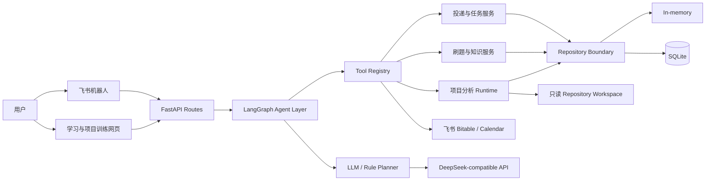

# OfferPilot

> 飞书原生 AI 求职管理与训练 Agent：把投递、面试、刷题、知识复习和项目训练放进一条可确认、可追踪、可恢复的执行链路。

OfferPilot 面向计算机专业学生的秋招与实习准备场景。用户可以直接在飞书中用自然语言管理投递和面试，也可以在配套网页中完成 LeetCode 复习、八股问答、GitHub 项目分析与项目面试训练。

项目的重点不是再做一个聊天机器人，而是让模型通过受控工具真正执行任务：理解消息、生成计划、请求写入确认、更新业务状态，并把结果同步到飞书多维表格和日历。

**当前状态：** 单用户求职闭环可运行；后端测试套件 `422 passed`；GitHub 项目分析已在 3 个不同规模的真实开源仓库上完成验收。

## 三条核心流程

### 1. 求职执行闭环

```text
飞书自然语言消息
  → 上下文恢复与意图识别
  → LLM Planner / 规则 Planner fallback
  → 写操作确认
  → Application / Task / Calendar 工具
  → SQLite 持久化
  → 飞书多维表格与日历同步
```

支持新增投递、更新阶段、记录面试轮次、补全时间、生成后续任务，以及取消或确认待执行动作。

### 2. 每日学习闭环

```text
LeetCode Hot 100 / Markdown 知识库
  → 确定性推荐与间隔复习
  → 网页或飞书提醒
  → 用户作答 / 语音转写
  → AI 评分与参考答案
  → 掌握度、薄弱点和下次复习时间
```

算法推荐使用本地公开元数据快照，八股学习中心可把本地 Markdown 增量解析为结构化题库。

### 3. 项目分析与面试训练闭环

```text
GitHub 仓库 URL
  → 隔离的只读 Workspace
  → 文件浏览 / 精确读取 / 代码搜索 / 受限命令
  → Agent 主动探索与上下文压缩
  → 项目画像与代码证据
  → 用户确认
  → 针对目标岗位的多轮项目面试训练
```

分析 Agent 不接受任意 Shell 字符串，只能调用结构化的只读工具；运行时同时限制模型轮次、工具次数、累计 Token、单次输出和工作区路径。

## 能力概览

| 模块 | 已实现能力 |
| --- | --- |
| Agent Orchestration | 基于 LangGraph 的消息处理图，覆盖上下文加载、确认态、Planner、路由、工具执行与状态同步。 |
| LLM Planner | 支持 DeepSeek-compatible Planner，并提供规则 fallback，模型不可用时仍可执行核心求职流程。 |
| Application Workflow | 管理公司、岗位、投递阶段、面试轮次、下一步动作与用户级会话草稿。 |
| Feishu Integration | 飞书事件回调、消息回复、多维表格双向同步、事件订阅、日历日程与提醒。 |
| LeetCode Hot 100 | 每日确定性推荐、标签反馈、掌握度和间隔复习，以及 08:00、12:00、18:00 分级提醒。 |
| 八股学习中心 | Markdown 增量入库、一题一卡、文字/语音作答、AI 评分、参考答案、薄弱点和复习计划。 |
| GitHub Project Discovery | 仓库克隆与安全文件索引、受控 Tool Calling、证据化项目画像、失败恢复与重试。 |
| Project Training | 项目档案、版本记录、岗位定向追问、回答评估、训练进度和总结。 |
| Persistence | Repository 边界下的内存与 SQLite 双实现。 |
| Quality | 测试覆盖 Agent、Planner、工具运行时、仓库分析、飞书集成、Dashboard 与持久化。 |

## 系统架构



项目分析运行时由四类通用工具构成：

- `list_files`：按目录浏览经过安全过滤的文件；
- `read_file`：按行列范围精确读取 UTF-8 文本；
- `search_code`：执行固定字符串代码搜索；
- `run_repository_command`：以参数数组执行白名单内的只读命令，不经过 Shell。

## 真实仓库验收

以下结果来自同一套项目分析 Agent 与默认收敛策略，不包含为特定仓库定制的工具：

| 仓库 | 安全文件数 | 模型轮次 | 工具调用 | 结果 |
| --- | ---: | ---: | ---: | --- |
| ItsDangerous | 50 | 9 | 22 | 完成 |
| Full Stack FastAPI Template | 245 | 15 | 56 | 完成 |
| Django REST Framework | 451 | 24 | 58 | 完成 |

三次运行均正常提交结构化终态，没有触发紧急截断，也没有出现 JSON 或终态协议错误。验收关注 Agent 能否在不同目录规模下完成探索、形成项目画像并主动结束；生成内容仍需用户确认后才会进入正式项目档案。

## 安全与可控性

- GitHub 仓库在任务级工作区中按只读方式分析；
- 拒绝路径逃逸、符号链接逃逸、二进制文件和超大文件；
- 命令执行不启用 Shell，只允许固定程序和安全参数组合；
- 写入业务数据前要求用户确认，并保存待确认状态；
- Debug 路由在生产环境默认关闭；
- 外部集成通过 Service 和 Repository 边界隔离，可在测试中替换；
- Agent 具备轮次、工具、Token 和请求体预算，并会压缩旧工具结果、识别重复探索和主动总结。

## Repository Layout

```text
.
├── backend/
│   ├── app/
│   │   ├── agents/             # LangGraph 编排、Planner、路由和通用 Tool Calling Runtime
│   │   ├── api/                # FastAPI、飞书回调和 Dashboard 路由
│   │   ├── core/               # 环境配置
│   │   ├── models/             # 领域模型
│   │   ├── project_analysis/   # GitHub Workspace、只读工具、命令执行器和分析服务
│   │   ├── repositories/       # Repository 接口、内存和 SQLite 实现
│   │   ├── schemas/            # API 与 Agent schema
│   │   ├── services/           # 业务流程、LLM、飞书、学习和项目训练服务
│   │   ├── tools/              # Agent 工具定义与注册表
│   │   └── web/                # 学习与项目训练页面
│   ├── tests/                  # 后端测试套件
│   ├── pyproject.toml
│   └── README.md
└── docs/                       # 产品方案、ADR 与阶段性开发记录
```

## Quick Start

### 1. 安装

```bash
git clone <your-offerpilot-repository-url>
cd OfferPilot/backend
python3 -m venv .venv
.venv/bin/python -m pip install -U pip
.venv/bin/python -m pip install -e ".[dev]"
```

### 2. 配置

```bash
cp .env.example .env
```

最小本地配置：

```env
OFFERPILOT_ENV=local
OFFERPILOT_ENABLE_DEBUG_ROUTES=true
OFFERPILOT_STORAGE_BACKEND=sqlite
OFFERPILOT_SQLITE_PATH=./data/offerpilot.db

OFFERPILOT_LLM_PROVIDER=deepseek
OFFERPILOT_LLM_MODEL=deepseek-v4-flash
DEEPSEEK_API_KEY=your-api-key
```

只有启用对应能力时才需要填写飞书、ASR 和公网 Dashboard 配置。完整变量与说明见 [`backend/.env.example`](backend/.env.example)。

### 3. 启动

```bash
.venv/bin/python -m uvicorn app.main:app --reload
```

服务默认监听 `http://127.0.0.1:8000`：

```bash
curl http://127.0.0.1:8000/api/health
```

调用 Agent：

```bash
curl -X POST http://127.0.0.1:8000/api/agent/message \
  -H "Content-Type: application/json" \
  -d '{"message":"新增投递字节跳动后端开发实习，明天下午三点一面"}'
```

### 4. 测试

```bash
.venv/bin/python -m pytest
```

截至 2026-08-18，完整后端测试结果为：

```text
422 passed
```

## 主要入口

| Endpoint | 用途 |
| --- | --- |
| `GET /api/health` | 健康检查。 |
| `POST /api/agent/message` | 正式 Agent 消息入口。 |
| `POST /api/feishu/events` | 飞书事件回调与消息处理。 |
| `GET /leetcode/dashboard` | LeetCode 每日推荐与反馈。 |
| `GET /study/knowledge` | 八股学习、评分和知识导航。 |
| `GET /study/projects` | 项目档案与历史版本。 |
| `GET /study/projects/discovery` | GitHub 项目发现与代码分析进度。 |
| `GET /study/projects/training` | 项目面试训练。 |
| `POST /api/study/project-discovery/jobs` | 创建项目分析任务。 |
| `POST /api/study/project-training/sessions` | 创建项目训练会话。 |

Dashboard 使用飞书 OAuth 识别用户。公网部署时请将一个稳定的 HTTPS Origin 同时配置到飞书开放平台和：

```env
OFFERPILOT_DASHBOARD_PUBLIC_BASE_URL=https://your-domain.example
OFFERPILOT_DASHBOARD_OAUTH_SCOPE=auth:user.id:read
OFFERPILOT_DASHBOARD_SESSION_SECRET=replace-with-a-random-secret
```

OAuth 回调地址为：

```text
https://your-domain.example/leetcode/dashboard/auth/callback
```

请勿把临时隧道地址、真实密钥、SQLite 数据库或运行时工作区提交到仓库。

## 当前边界

- 当前产品以个人求职使用为主，不承诺团队级多租户、权限管理和审计合规；
- 飞书 OAuth、消息推送、多维表格和日历需要自行创建飞书应用；
- 项目分析结果是基于代码证据生成的候选画像，确认前不会覆盖正式项目档案；
- 免费临时隧道适合本地联调，不适合作为长期演示地址。

## Documentation

- [产品需求与技术方案](docs/OfferPilot-需求与技术方案.md)
- [后端运行说明](backend/README.md)
- [ADR：本地 OfferPilot 作为事实源](docs/adr/0001-local-offerpilot-as-source-of-truth.md)
- `docs/` 中的阶段性报告记录了 Agent、飞书集成、学习中心和项目训练模块的演进。

## Roadmap

- 补充稳定的公开演示环境与产品演示视频；
- 引入持续集成、静态检查和测试覆盖率报告；
- 继续提升项目分析结论与源代码证据之间的语义一致性；
- 在单用户闭环稳定后评估多用户、权限与 Web 控制台。
